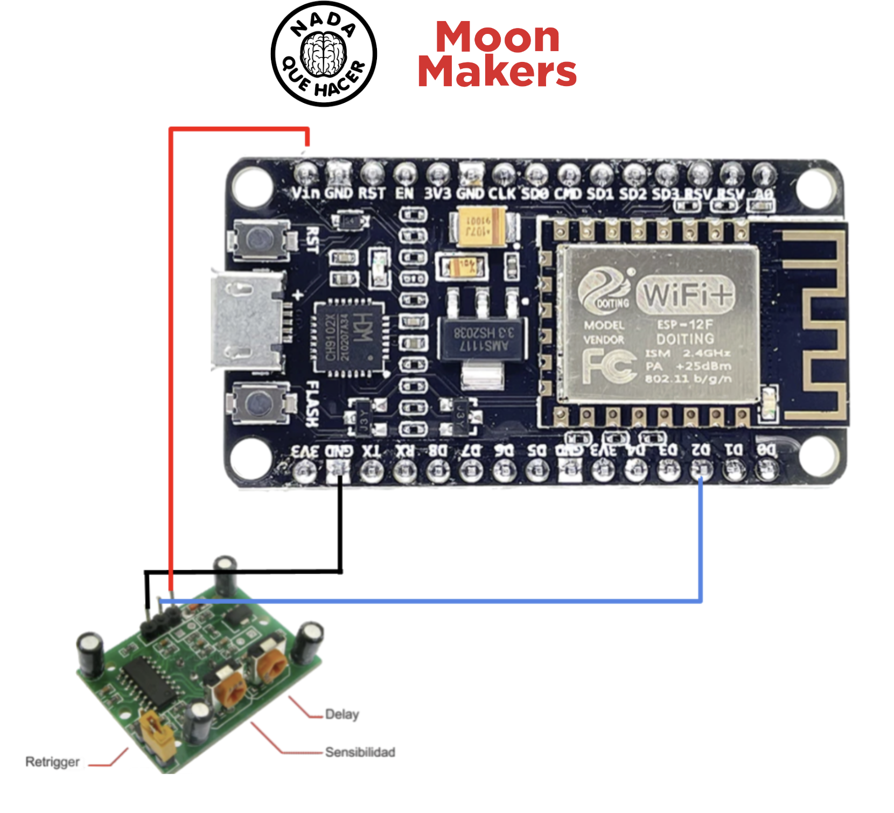
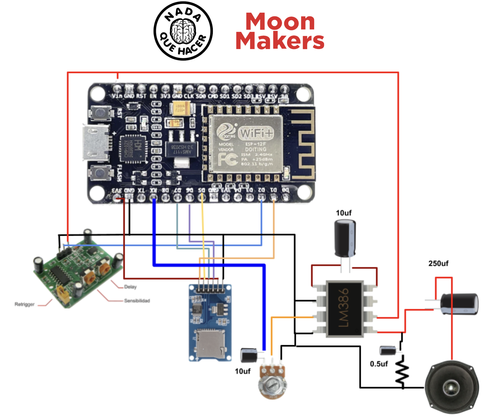

# Proyecto de Detección de Movimiento con NodeMCU y LM386

## Descripción
Este proyecto utiliza un NodeMCU para detectar movimiento a través de un sensor PIR y, en respuesta, reproduce un archivo de audio almacenado en una tarjeta SD. La señal de audio se amplifica utilizando un circuito con un LM386.

## Creadores
- **MoonMakers**
- **Nada que hacer**

## Esquemático de Conexiones del proyecto basico

## Esquemático de Conexiones del proyecto con la bocina

## Componentes
- NodeMCU
- Sensor PIR
- LM386 Amplificador
- Tarjeta SD
- Bocina

## Código Fuente

### NodeMCU
- http://arduino.esp8266.com/stable/package_esp8266com_index.json
### Librerias
- [ESP8266Audio](https://github.com/earlephilhower/ESP8266Audio)
- [SD](https://github.com/arduino-libraries/SD)
